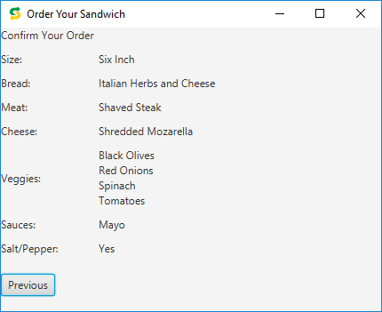

# "Subway Ordering System"
### Created By: Rachel Myers | Nick Schneider | Chance Battles

•	This ordering system allows a user to select and build their very own sub-sandwich using Java coding. 

 

## Analysis Steps

We first tackled the UML and Wireframe diagrams whilst also starting the project log.
Once these has been established we split up the different categories into scenes and everyone did specific sections of the code.
Afterwards, we compiled all the code into one program and began bug fixing and reformatting to allow for all the code to mesh.
After this, It was mainly bug fixing and trimming to acquire a more desirable program.

### Design

We used one main class and separated out our code using comments in a pseudo-comment class system.
By separating our code segments out, it was much easier to find where the issues were based on which panel they were in.
Example: If something went wrong on the Cheese Pane we just needed to scroll down to the cheese commentation and then isolate the issue. This process made bug fixing significantly easier.
### Testing

Through testing the program, we noticed several different things:
1.	We originally had the program printing to the confirmation page as the buttons were clicked. We now have the program set to print on the Next button to avoid re-printing.
2.	We also used a variable attached to our items that prints to the order page rathe than simply pressing and printing. This fixed many reprinting problems in the wizard as well. 

